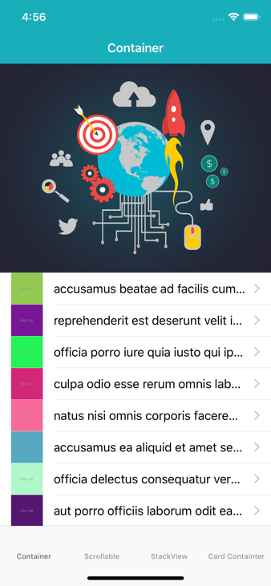

## Example of using Coordinators and Container View Controllers in iOS

You can find the related blog post on Medium at [Container View Controllers Redux](https://medium.com/@dkw5877/container-view-controllers-revisited-e076ef38853f)

### Points of Interest
In general the sample code covers the use of container view controller in iOS development to illustrate the concepts of separation of concerns, composition, and the application controller pattern.

#### Coordinators
The app uses the concept of Coordinators to handle the navigation flow of the app.

#### Basic View Controller Containment
The sample code uses view controller containment to combine an image loading view controller and a table view controller to form a screen of content.

#### Scrolling Container View Controller
The sample code shows an example of a scrolling container view controller. The container view controller overrides load view to use a UIScrollView where it displays the contents of injected view controllers

#### StackView Controller
The sample code shows an example an example of a stack view container view controller. Similar to the scrolling view controller, this view controller overrides loadView to implement a UIStackView that holds the contents of two view controllers. The stack view controller is then added to a scrolling view controller to allow content scrolling.

#### Card Container View Controller
The sample code shows an example of using a container view controller to hold a screen of content and interactively display a separate card view controller. This example illustrates an alternative to coordinators by encapsulating the functionality of two view controllers into a single view controller. This concept could be extend to encapsulte application flows in a container view controller. 

 <!-- .element height="50%" width="50%" -->
 <!-- .element height="50%" width="50%" -->
 <!-- .element height="50%" width="50%" -->
 <!-- .element height="50%" width="50%" -->
